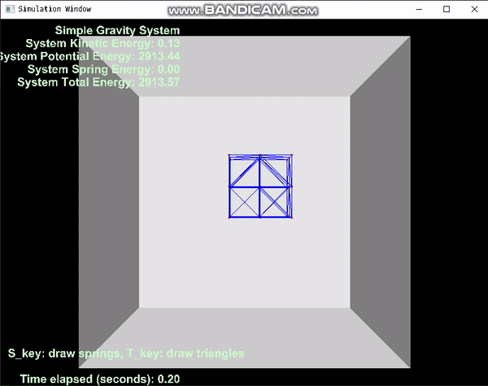
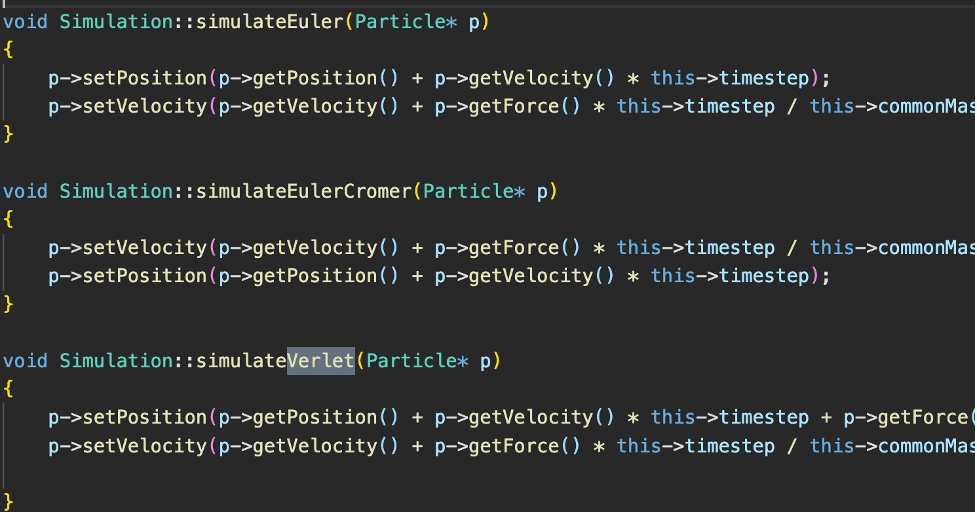
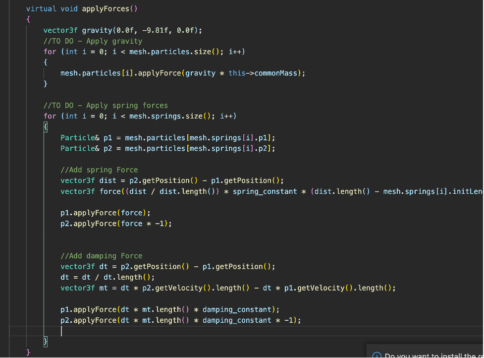
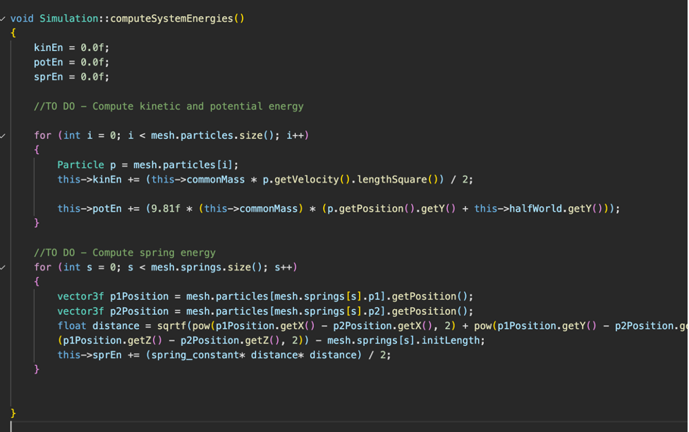
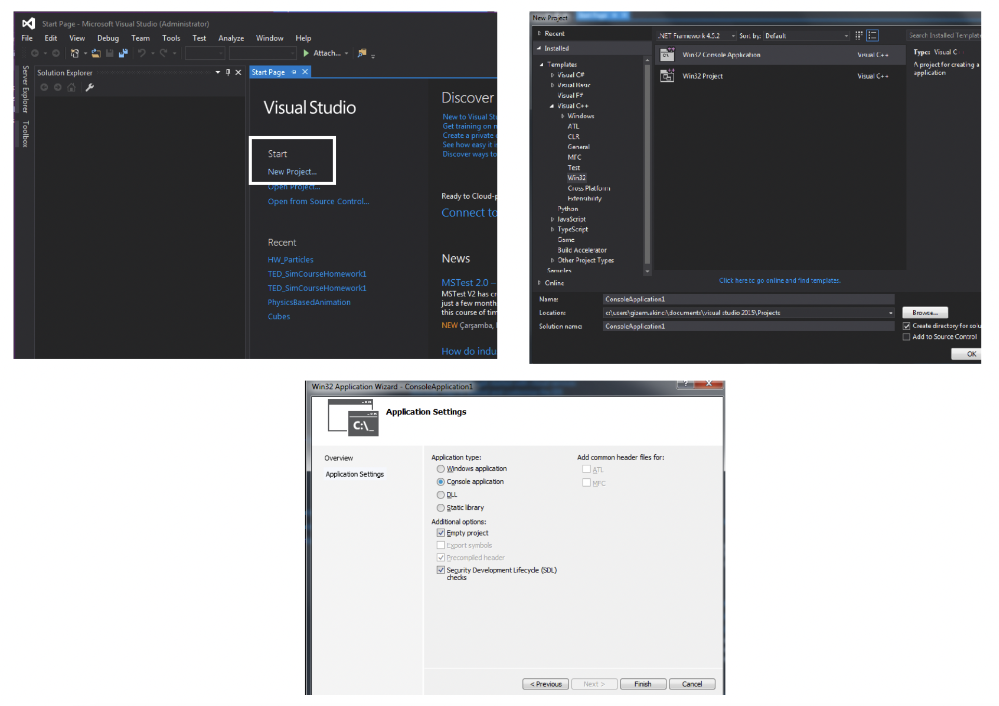
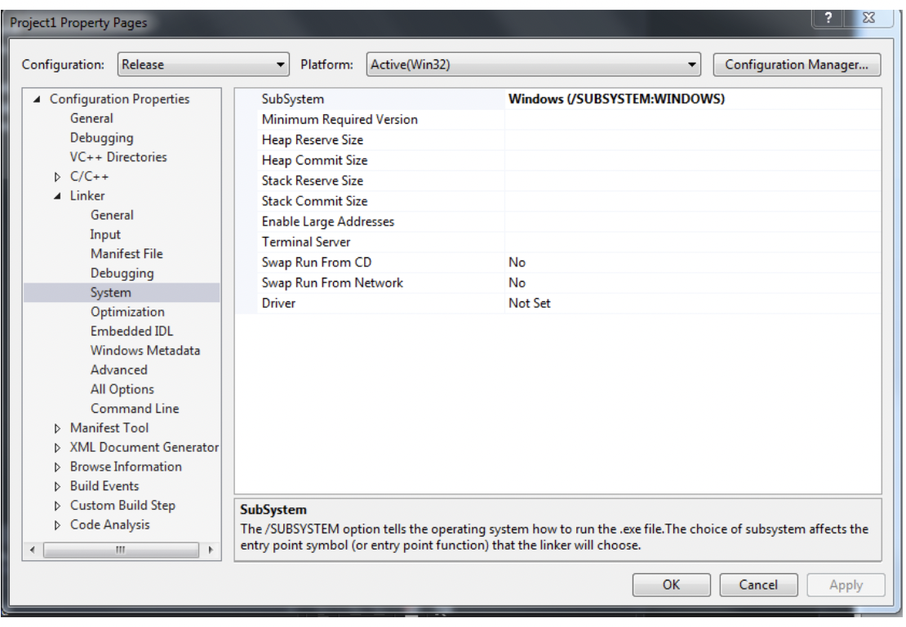

# **Spring Simulator**

**Ashay Changwani**
___
This project is Part 2 of my simulation series:

[Part 1 - Particle Simulation](http://github.com/ashaychangwani/particleSimulation)

[Part 3 - Rope Simulation](http://github.com/ashaychangwani/ropeSimulation)

For this project, I will simulate a 3D cube where each edge and diagonal of the cube is a spring.

___
1. Task 1 – Integration Schemes & Apply Forces

This is very similar to the simulation used in the previous scheme, except that in the previous
scheme there was no change in the force acting on a point.

Hence, our Verlet integration scheme changes slightly and we consider the current force and
the previous force separately in the equation instead of considering them as the same.

In this phase, we use Hooke’s Law to calculate the spring force based on the displacement of
the spring and the equation provided to us in the slides.

Next, we also add a damping force directly proportional to the velocity of the point of the
spring in the opposite direction.

2. Task 2 – Energy Computation

The computation of the kinetic and potential energy stay exactly the same, since they are
unaffected by the addition of springs between the points.

The spring energy however, needs to be computed. We do this by extracting the two points on
the ends of the spring. We require these points to calculate the current length of the spring.

The spring class stores the initLength object which shows us the original length. This helps us
calculate the displacement as (currentLength – initLength). We can multiply this displacement
with the spring_constant variable provided to us to compute the Spring Energy as:

E = 𝑘𝒙𝟐

# OPENGL	SETUP

- Download shared files
- Create a new folder, e.g. GL_Folder, to put the content ( glew and freeglut)
- Create an empty C++ project in Visual studio (see below).

- Right click Project &rarr; Properties &rarr;Configuration Properties &rarr; VC++ Directories &rarr;Include Directories:
    Select **_Include_** folders of both glew and freeglut
- Configuration Properties &rarr; Linker &rarr; Input:
    Additional Dependencies:
    Write: **_glew32.lib_** and **_freeglut.lib_**
- Configuration Properties &rarr; Linker &rarr; General:
    Additional Library Directories:
    Select **_lib_** folders of both glew and freeglut
- Copy **_glew32.dll_** and **_freeglut.dll_** from GL_Folder and paste them to your project folder

`
Be sure that your subsystem is Windows:
`

`
And your character set is set to: Not Set
`

